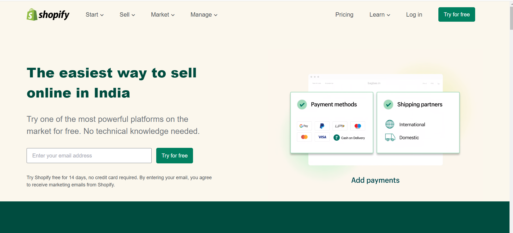

## About The Project

[Shopify Clone](https://sh0pify.netlify.app/)

Landing Page:

- Built using Tailwind CSS
- Web first design - Web Only
- Font Awesome icons used

(<a href="#readme-top">back to top</a>)

### Built With

Here are a few examples.

- [![][html.com]][html-url]
- [![Tailwind][css.com]][css-url]
- [![Font Awesome][fs]][fs-url]

(<a href="#readme-top">back to top</a>)

<!-- GETTING STARTED -->

## 1. Getting Started

### Prerequisites

### Installation

(<a href="#readme-top">back to top</a>)

<!-- USAGE EXAMPLES -->

## Usage

_For more examples, please refer to the [Documentation](https://google.com)_

(<a href="#readme-top">back to top</a>)

<!-- ROADMAP -->

## Roadmap

(<a href="#readme-top">back to top</a>)

<!-- CONTRIBUTING -->

<!-- CONTACT -->

## Contact

Manish Katiyar - [Linkedin](https://www.linkedin.com/in/manish-k-7059a738/)

Email me - [trend.manish@gmail.com](trend.manish@gmail.com)

Project Link: [Hosted on Netlify](https://sh0pify.netlify.app/)

(<a href="#readme-top">back to top</a>)

- [GitHub Emoji Cheat Sheet](https://www.webpagefx.com/tools/emoji-cheat-sheet)
- [Img Shields](https://shields.io)
- [GitHub Pages](https://pages.github.com)
- [Font Awesome](https://fontawesome.com)
- [React Icons](https://react-icons.github.io/react-icons/search)

(<a href="#readme-top">back to top</a>)

[html.com]: https://img.shields.io/badge/HTML-FF2D20?style=for-the-badge&logo=HTML&logoColor=white
[html-url]: https://test.com
[css.com]: https://img.shields.io/badge/Tailwind-CSS-563D7C?style=for-the-badge&logo=bootCSSstrap&logoColor=white
[css-url]: https://test.com
[fs]: https://img.shields.io/badge/FS-0769AD?style=for-the-badge&logo=FS&logoColor=white
[fs-url]: https://jquery.com
